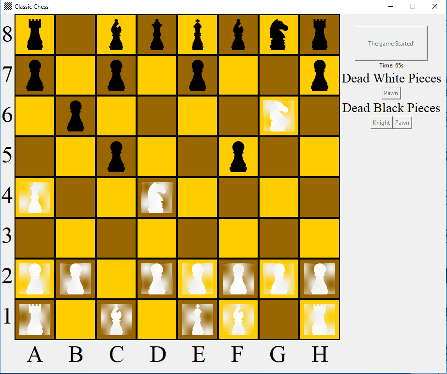

# Finished projects

__Pokedex__: Simple Pokedex with an Interactive GUI.
- PokedexDB is a side project to retrieve pictures and data

__Webpage__: Creating a webpage using DJango Framework.

- Pokedex included

__Chess__: Chess game with GUI.

# Working projects

__Sudoku__: Sudoku game with GUI.

# Future projects

- __HTML parser__
- I like japanese light novels. 

  I want to read them at university while waiting to start the lesson. 
  
  I need an App to read them.
  
  Uhm, they have ads
  
  __Let's create Free ads PDF reader__
