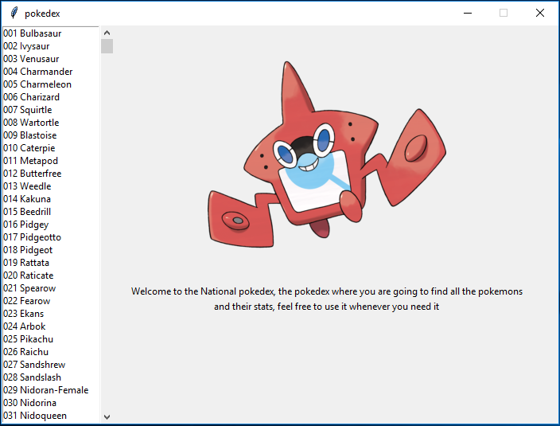
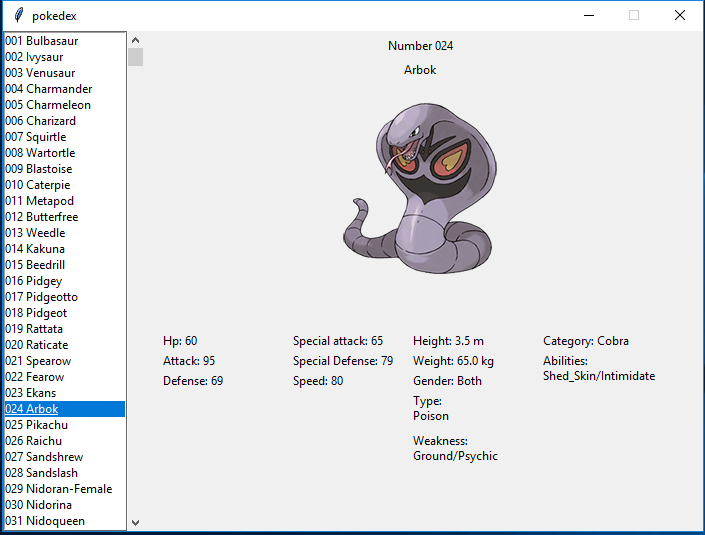
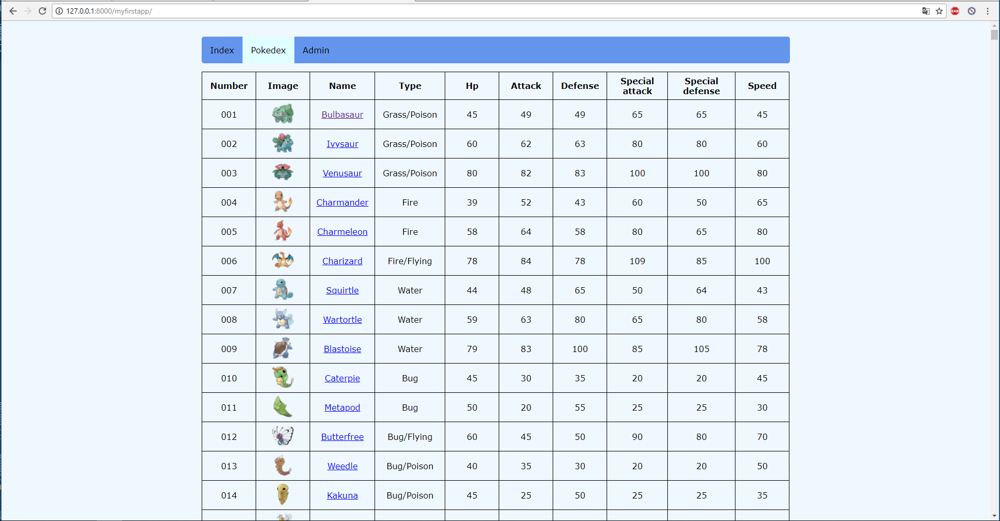
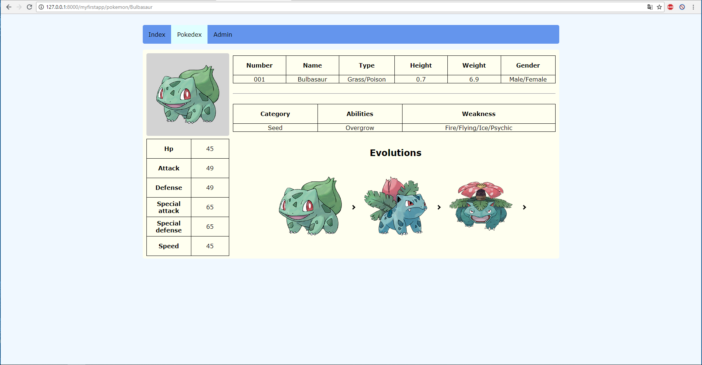
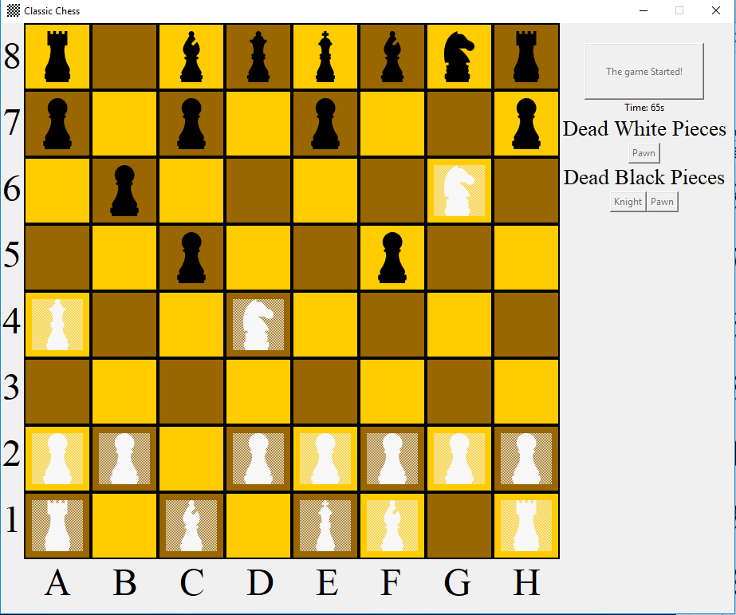

# Small-Projects
Small projects using mainly python

__Pokedex__: Simple Pokedex with an Interactive GUI.
- PokemonDB is a side project to retrieve pictures and data

__Webpage__: Creating a webpage using DJango Framework.

- Pokedex included

__Chess__: Basic GUI based chess.

Future projects:
- Sudoku
- HTML parser
