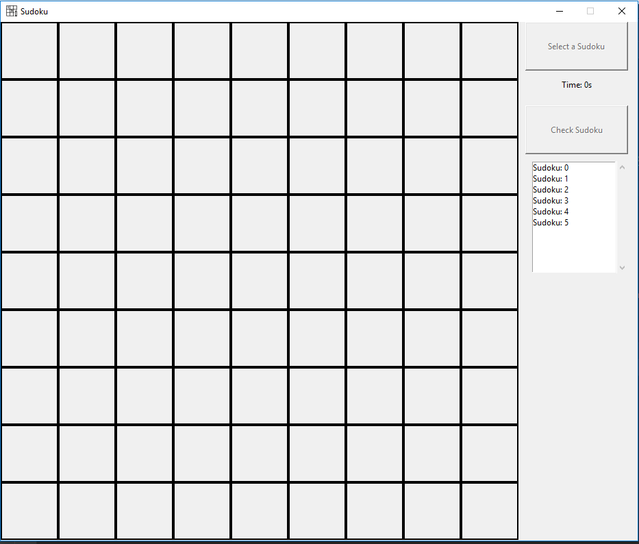

# Small-Projects
Small projects using mainly python

__Pokedex__: Simple Pokedex with an Interactive GUI.
- PokedexDB is a side project to retrieve pictures and data

__Webpage__: Creating a webpage using DJango Framework.

- Pokedex included

__Chess__: Chess game with GUI.

Working projects:

__Sudoku__: Sudoku game with GUI.

Future projects:
- HTML parser
