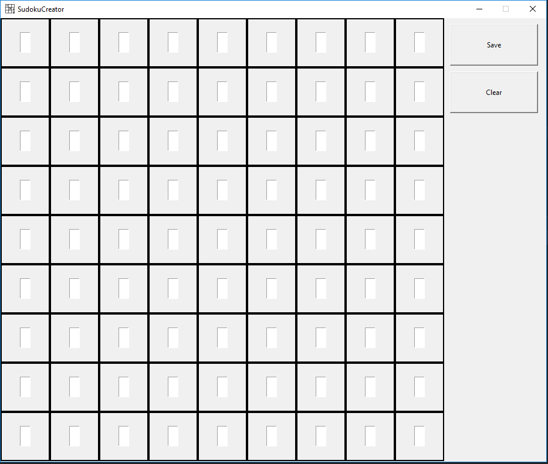

Everything developed in python 3.6

# Finished projects

__Pokedex__: Simple Pokedex with an Interactive GUI.
- PokedexDB is a side project to retrieve pictures and data

__Webpage__: Creating a webpage using DJango Framework.

- Pokedex included

__Chess__: Chess game with GUI.

__Sudoku__: 
- Sudoku game with GUI.

- Sudoku creator with GUI

__Cache Memory Simulator__:

School project that i thought it will be interesting to have here.
- 2 Replacement policies: LRU (Least Recently Used) and FIFO (First in First Out)
- Write strategy: Write-Back
- 3 correspondece structures: Fully Associative, Set Associative and Direct Mapped
- No GUI implementation.
