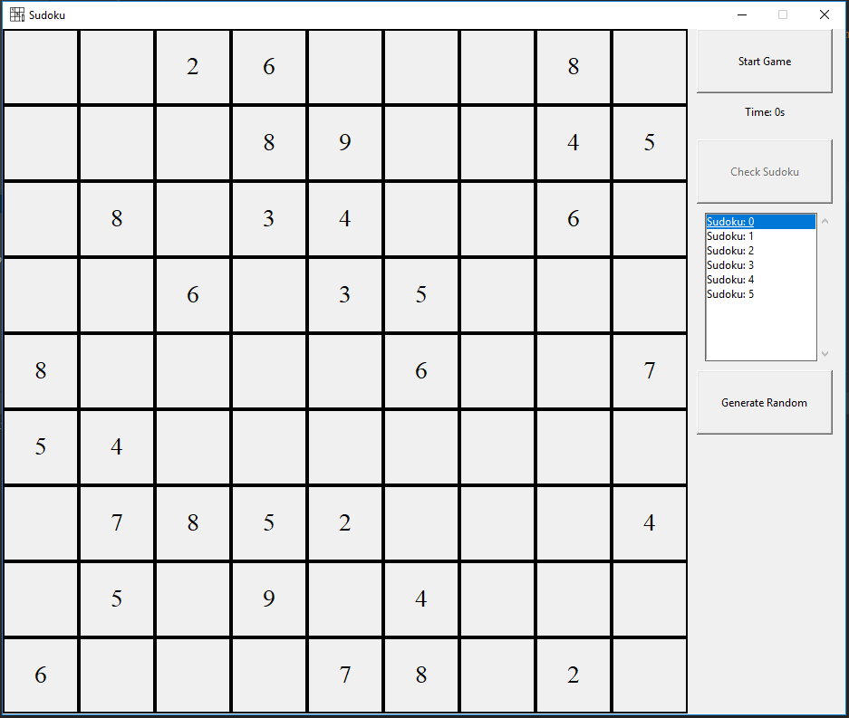
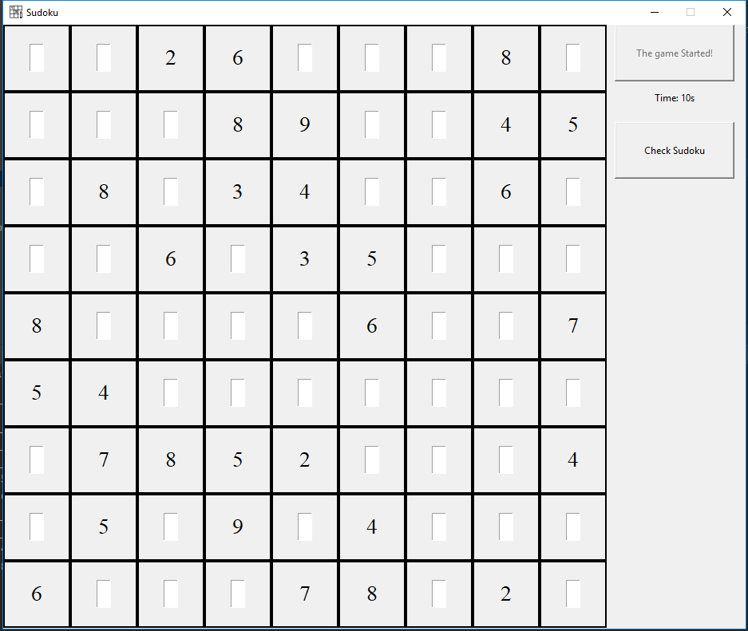
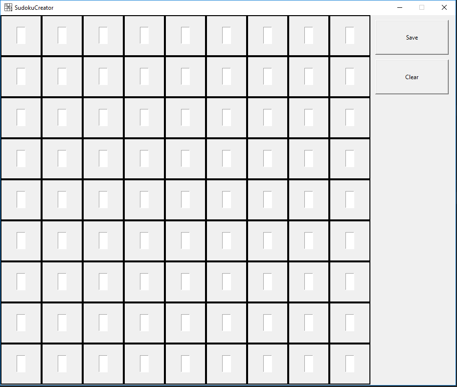

# Sudoku

Sudoku game programmed in python and using Tkinter for the GUI.

For playing run __main.py__, select a Sudoku from the list and click Start Game.

Future Features:
- Automatic Sudoku Generator.

You can create your own Sudokus running the __MainSudokuCreator.py__

Actually the Sudokus are stored in a CSV file. 

Note: I know it's not the best choice to use CSV files, is only for learning purposes.

Pictures

Sudoku creator

